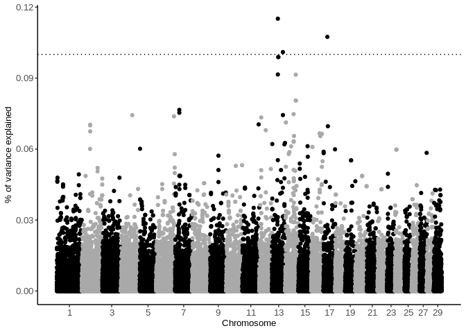
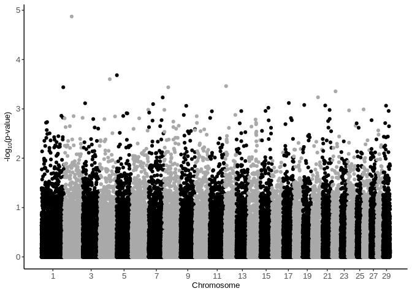

### The aim of this notebook is to demonstrate a way to create custom Manhattan plots for BLUPf90 (https://masuday.github.io/blupf90_tutorial/) output


```r
library(tidyverse)
```

```
## ── Attaching packages ─────────────────────────────────────────────────────────────────────────────────────────────────────────── tidyverse 1.3.0 ──
```

```
## ✓ ggplot2 3.3.2     ✓ purrr   0.3.4
## ✓ tibble  3.0.3     ✓ dplyr   1.0.0
## ✓ tidyr   1.1.0     ✓ stringr 1.4.0
## ✓ readr   1.3.1     ✓ forcats 0.5.0
```

```
## ── Conflicts ────────────────────────────────────────────────────────────────────────────────────────────────────────────── tidyverse_conflicts() ──
## x dplyr::filter() masks stats::filter()
## x dplyr::lag()    masks stats::lag()
```

### Loading data for first plot

```r
dfvar <- read.table('~/macierz/ch4_ppm/models/5ped/chrsnpvar')
dfvar <- dfvar %>% filter(V2 == 6 & V1 == 1)
x <- dfvar$V4
y <- dfvar$V3
```

### Manhattan plot for % variance explained by each SNP

```r
chrlist <- c()

for (i in 1:max(unique(dfvar$V5))) {
  chrlist[i] <- median(dfvar$V4[dfvar$V5 == i])
}


dfvar %>% ggplot(aes(x = x, y = y, col = as.factor(dfvar$V5))) + geom_point() + theme_classic() + 
  theme(
    legend.position = "none",
    axis.title = element_text(size = 14),
    axis.text = element_text(size = 14)) + 
    scale_x_continuous(labels =seq(1,29,2), breaks = chrlist[seq(1,29,2)]) + 
    scale_color_manual(values = rep(c("#000000", "#A9A9A9"), length(unique(dfvar$V5)))) +
  ylab('% of variance explained') +
  xlab('Chromosome') +

  geom_hline(yintercept = 0.1, linetype = 'dotted') + 
  theme(plot.title = element_text(size = 10, hjust=0.5), axis.title.x = element_text(size = 10), axis.title.y = element_text(size = 10), axis.text.x =  element_text(size = 10), axis.text.y =  element_text(size = 10))
```

```
## Warning: Use of `dfvar$V5` is discouraged. Use `V5` instead.
```

<!-- -->

### Loading data for second plot


```r
dfvar <- read.table('~/macierz/ch4_ppm/models/5ped/chrsnp_pval')
dfvar <- dfvar %>% filter(V2 == 6 & V1 == 1)
x <- dfvar$V4
y <- dfvar$V3
```

### Classic Manhattan plot of -log10 pvalues for each SNP


```r
chrlist <- c()

for (i in 1:max(unique(dfvar$V5))) {
  chrlist[i] <- median(dfvar$V4[dfvar$V5 == i])
}


dfvar %>% ggplot(aes(x = x, y = y, col = as.factor(dfvar$V5))) + geom_point() + theme_classic() +

  theme(
    legend.position = "none",
    plot.title = element_text(size = 20, hjust=0.5),
    axis.text = element_text(size = 20)) + 
  scale_x_continuous(labels = seq(1,29,2), breaks = chrlist[seq(1,29,2)]) + 
  scale_color_manual(values = rep(c("#000000", "#A9A9A9"), length(unique(dfvar$V5)))) +
  ylab(expression('-log'[10]*'(p-value)')) +
  xlab('Chromosome') +
  theme(plot.title = element_text(size = 10, hjust=0.5), axis.title.x = element_text(size = 10), axis.title.y = element_text(size = 10), axis.text.x =  element_text(size = 10), axis.text.y =  element_text(size = 10))
```

```
## Warning: Use of `dfvar$V5` is discouraged. Use `V5` instead.
```

<!-- -->
