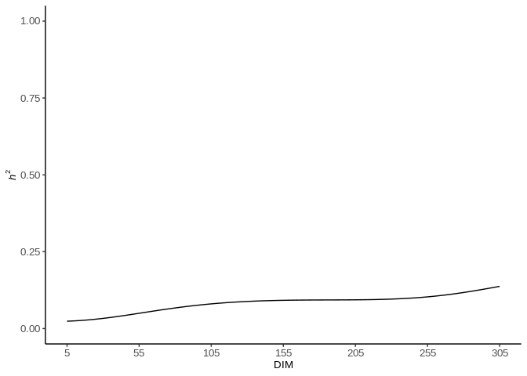
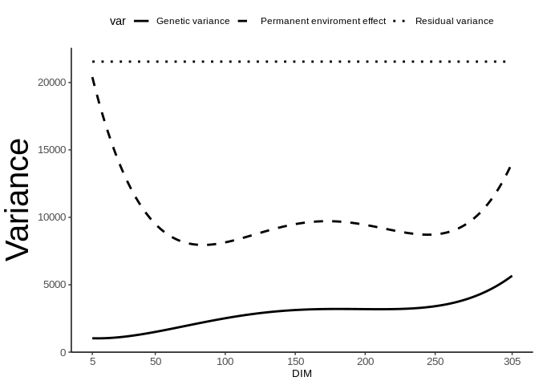

### The aim of this notebook is to present way of processing of BLUPf90 software output (https://masuday.github.io/blupf90_tutorial/) i.e. heritability and variance components estimation for CH4 emission in dairy cattle expressed in CH4 particles per million / day (CH4 ppm/d)


```r
library(tidyverse)
```

```
## ── Attaching packages ────────────────────────────────────────────────────────────────────────────────────────────────────────── tidyverse 1.3.0 ──
```

```
## ✓ ggplot2 3.3.2     ✓ purrr   0.3.4
## ✓ tibble  3.0.3     ✓ dplyr   1.0.0
## ✓ tidyr   1.1.0     ✓ stringr 1.4.0
## ✓ readr   1.3.1     ✓ forcats 0.5.0
```

```
## ── Conflicts ───────────────────────────────────────────────────────────────────────────────────────────────────────────── tidyverse_conflicts() ──
## x dplyr::filter() masks stats::filter()
## x dplyr::lag()    masks stats::lag()
```

### Loading data

```r
df <- read.delim('model_ch4ppm.dat', sep = ' ',header=F)

dim_scaled<- read.table('legendres.dat') %>% select(c(-V1,-V5))
```

### Creating matrices for variance components calculated with BLUPf90 software


```r
# Genomic variance matrix
varG <- matrix(c(     4298. ,      714.3,      -616.0 ,   
                      714.3 ,      885.5   ,    279.0 ,   
                      -616.0,       279.0,       499.2  ), ncol = 3)

# Permanent enviroment effect variance matrix
varPe <- matrix(c(   0.1333E+05,   246.8,      -971.5,    
                     246.8 ,      3616.,      -929.6,    
                     -971.5 ,     -929.6,       2925.), ncol=3)

# Residual variance
var.resid <- 0.2155E+05  
```
### The aim is to convert calculated variances for each, individual day in milk (DIM)


```r
z <- as.matrix(dim_scaled)

genvar <- z %*% varG %*% t(z) 
diagen.var <- diag(genvar)

pevar <- z %*% varPe %*% t(z)
diagpe.var <- diag(pevar)

herdim <- diagen.var / (diagen.var + var.resid + diagpe.var)

Gmat <- varG
Gmat <- z %*% Gmat %*% t(z)
Pemat <- varPe
Pemat <- z %*% Pemat %*% t(z)
E <- var.resid

newPmat <- matrix(nrow = 3, ncol = 3)
newPmat<- Gmat+Pemat+E

var <- 'Genetic variance'
d <- diagen.var
dim <- 5:305
df.gen <- data.frame(d, var, dim)

var <- 'Permanent enviroment effect'
d <- diagpe.var
dim <- 5:305
df.pe <- data.frame(d, var, dim)

var <- 'Residual variance'
d <- var.resid
dim <- 5:305
```

### Heritability estimates for CH4 ppm/day phenotype across the lactation period


```r
data.frame(herdim, dim <- 5:305) %>% ggplot(aes(dim, herdim)) + geom_line() + 
  theme_classic() + 
  ylim(c(0,1)) +
  scale_x_continuous(breaks = seq(5, 305, by = 50)) + theme(legend.title = element_blank(), legend.direction = 'vertical', legend.text = element_text(size = 10)) + ylab(expression(italic('h')^2)) + xlab('DIM') +  theme(plot.title = element_text(size = 10, hjust = 0.5), axis.title.x = element_text(size = 10), axis.title.y = element_text(size = 10), axis.text.x =  element_text(size = 10), axis.text.y =  element_text(size = 10)) + ggsave('herdim.png', dpi = 320, scale = 3)
```

```
## Saving 21 x 15 in image
```

<!-- -->

### Variance components estimates for CH4 ppm/day phenotype across the lactation period


```r
df.res <- data.frame(d, var, dim)

df.var <- rbind(df.gen, df.pe, df.res)

df.var %>% ggplot(aes(x = dim, y = d, linetype= var)) + geom_line(size = 1) + theme_classic()+  theme(legend.position = 'top') + ylab('Variance') + xlab('DIM') + theme(plot.title = element_text(size = 10, hjust=0.5), axis.title.x = element_text(size = 10), axis.title.y = element_text(size = 30), axis.text.x =  element_text(size = 10), axis.text.y =  element_text(size = 10)) + scale_linetype_manual(values=c("solid", "dashed", 'dotted')) + scale_x_continuous(breaks = c(5,50,100,150,200,250,305)) + ggsave('varcomp.png', dpi = 320, scale = 3) 
```

```
## Saving 21 x 15 in image
```

<!-- -->


